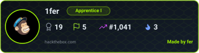

# **🛡️ Cybersecurity Portfolio**

Welcome to my cybersecurity portfolio.

This repository documents my journey into practical cybersecurity through hands-on labs, penetration testing, security challenges, and professional certifications.

My main focus is on developing practical skills in penetration testing, web security, network security, Linux, vulnerability assessment, and security operations.

The portfolio primarily contains write-ups from TryHackMe and Hack The Box, documenting the methodology, tools, techniques, and lessons learned from each challenge.

## **🚩Hands-on Labs**

**Hack The Box**

<!--
-->

**TryHackMe**

## **✍️ Writeups**
I use Hack The Box to develop practical penetration-testing skills through vulnerable machines and challenges.

Write-ups cover the complete attack path where appropriate, including:

- Reconnaissance
- Enumeration
- Vulnerability identification
- Initial access
- Exploitation
- Credential discovery
- Privilege escalation
- Post-exploitation
- Lessons learned

##  **🎓Certifications & Training**

| Certification | Issuer | Credential |
|---|---|---|
| **Certified Information Systems Security Professional (CISSP)** | ISC2 | [Verify Credential](https://www.credly.com/badges/87395266-7ee8-4be9-be86-3dcb054419bb/public_url) |
| **Certificate of Cloud Security Knowledge v.5** | CSA | [Verify Credential](https://www.credly.com/badges/345a7981-9b00-47f3-b479-fc0cec1e2c14/public_url) |
| **ISO/IEC 27001 Lead Implementer** | PECB | [Verify Credential](https://www.credly.com/badges/47115136-9c7f-4023-8d1d-f6329bb5f476/public_url) |
| **SC-100 Cybersecurity Architect Expert** | Microsoft | [Verify Credential](https://learn.microsoft.com/en-us/users/jonaskristofferboneng-7898/credentials/c89e9733aaf9dee?ref=https%3A%2F%2Fwww.linkedin.com%2F) |
| **SC-300 Identity and Access Administrator Associate** | Microsoft | [Verify Credential](https://learn.microsoft.com/en-us/users/jonaskristofferboneng-7898/credentials/dae49cb1e1948016) |
| **ISO/IEC 27005 Risk Manager** | PECB | [Verify Credential](https://www.credly.com/badges/faea7c17-c54c-421e-a54e-0be6612f988a/public_url) |
| **AZ-900 – Azure Fundamentals** | Microsoft | [Verify Credential](https://www.credly.com/badges/72ea6722-821c-46fd-b580-7e6abb0a63dc/public_url) |
| **SC-900 – Security, Compliance & Identity Fundamentals** | Microsoft | [Verify Credential](https://www.credly.com/badges/e4f6b0bc-7bfe-41f8-817a-f723ec2b0cce/public_url) |
