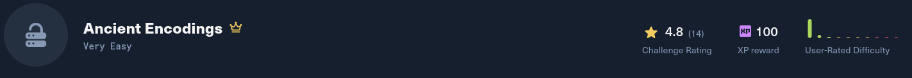

**Platform:** Hack The Box  
**Difficulty:** Very Easy  
**Category:** Crypto

The following two files are included in the downloaded folder. Reading the `source.py` crypto code where the encoding logic is: ``return hex(bytes_to_long(b64encode(message))``. The message is first base64-encoded, then converted to a hex string, which is written to `output.txt`.

Using [Cyberchef](https://gchq.github.io/CyberChef/) the reverse operations were applied to `output.txt` (hex → integer/bytes → base64 decode) to recover the challenge flag.

