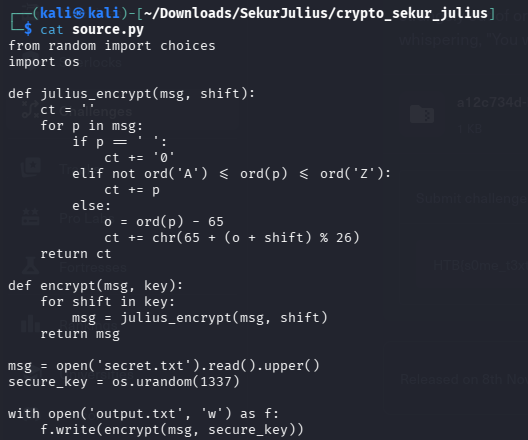

**Platform:** Hack The Box  
**Difficulty:** Very Easy  
**Category:** Crypto

The following two files are included in the downloaded folder, `output.py` and `source.py`.  Reading the `source.py` crypto the code loops through each character `p` in `msg`. With three if sentences:
* If `p` is a whitespace `" "` it adds a 0
* Else if `p` is not a character between A-Z it gets added unchanged
* Else (it's a letter between A–Z): get the ASCII value of the letter, subtract 65 to turn it into an index (0–25), shift that index forward by `shift` wrapping around with `% 26`, then add 65 back to convert it back into a letter.

The `shift` value comes from `seucre_key = os.random(1337)` generating 1337 random bytes, between 0-255. Each of these bytes is used as a separate `shift` value, applied after another so the message is Caesar-shifted 1337 times in a row with a different random shift amount each time. 

UUsing [CyberChef](https://gchq.github.io/CyberChef/), we tried different reverse rotations, the most common one being ROT13, and got something readable. Afterwards, we replaced the 0's with whitespaces again to find the flag.

