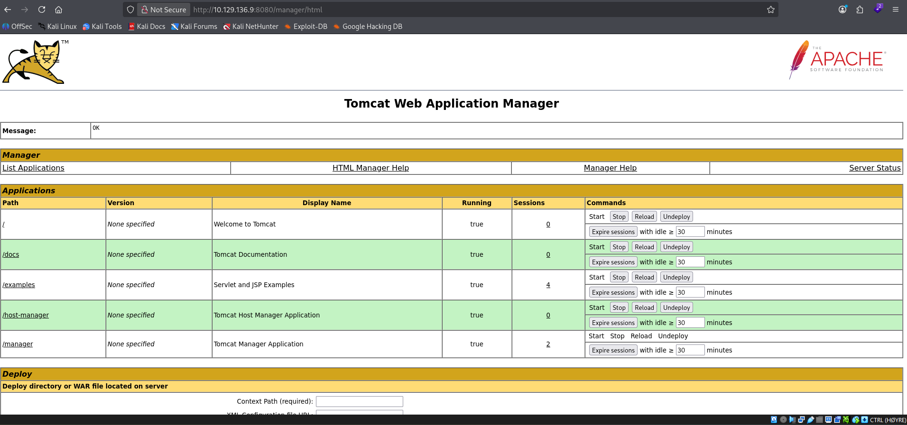
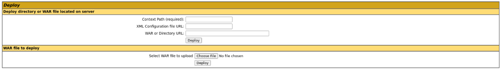
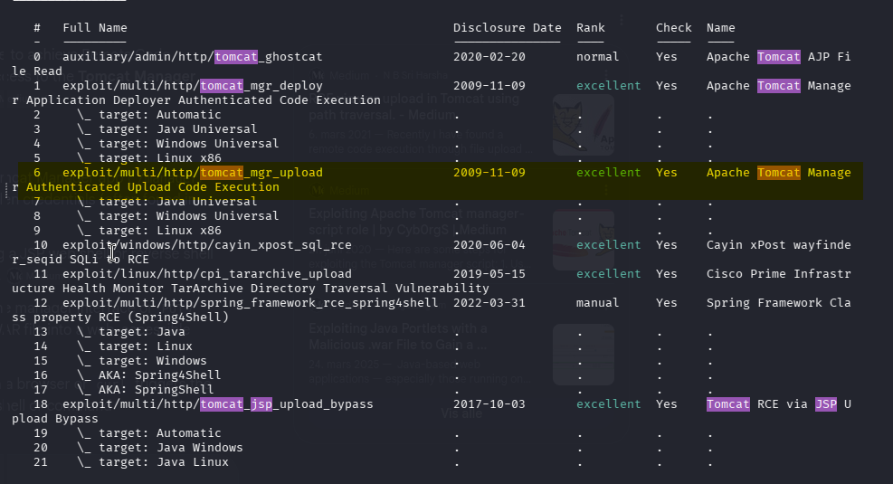
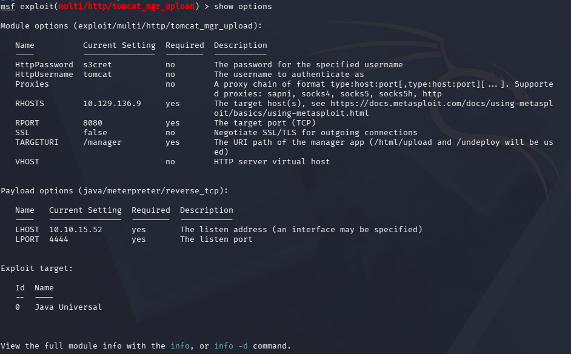
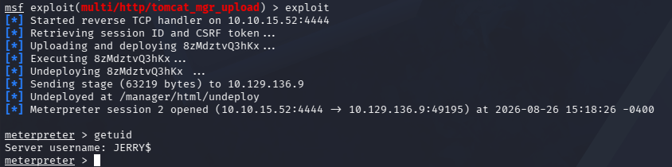
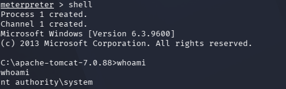
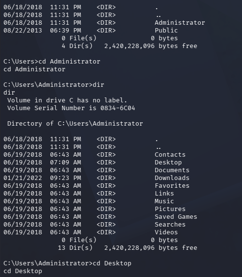
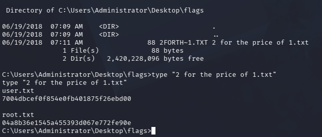

**Platform:** Hack The Box  
**Difficulty:** Easy  
**OS:** Windows Server 2012 R2  
**Target IP:** `10.129.136.9` 
## Overview

Exploitation via default credentials on Tomcat Manager (`tomcat:s3cret`), enabling authenticated WAR file upload for remote code execution. This is not tied to a specific CVE, as it stems from a configuration weakness with weak/default credentials left on the Manager interface rather than a flaw in Tomcat's code itself. The compromised Tomcat service was also running as `NT AUTHORITY\SYSTEM`, granting immediate full administrative access upon exploitation with no further privilege escalation required.
## Attack Path


```
Nmap
  ↓
Apache Tomcat Enumeration
  ↓
Apache Tomcat 7.0.88 Identified
  ↓
Nuclei - Default Credentials Fond
  ↓
Metasploit - Tomcat Manager WAR Upload
  ↓
Meterpreter Session (SYSTEM)
  ↓
User Flag
  ↓
Administrator / Root Flag (same access)
```

## 1. Reconnaissance

Using nmap to check for services running on the Jerry machine with ip `10.129.136.9`, where we can see Apache Tomcat/7.0.88 running on port `8080`

`


Visiting the website `10.129.136.9:8080` confirms Tomcat is running. 


## 2. Apache Tomcat Enumeration 

I decide to use Nuclei on the Apache Tomcat service, looking for any known vulnerabilities related to the version `Apache Tomcat 7.0.88` or any default-login or default configuration. Nuclei checks and finds tomcat default login in the `/manager` subdomain, where the default username tomcat and password s3cret. 


## 3. Vulnerability Identification

Visiting the `http://10.129.136.9:8080/manager/html` and logging in with the credentials detected by nuclei, granting us access to Tomcat Web Application Manager. 


From this website we see we can upload WAR files to the server which indicates this could be an Authenticated Upload Code Execution



## 4. Exploitation

After doing some research on Metasploit, we find a suitable Authenticated Upload Code Execution for Apache Tomcat Manager. We use the exploit/multi/http/tomcat_mgr_upload.




Furthermore, we set the options with the credentials detected by nuclei, the RHOST as the Tomcat Machine IP and our tun0 IP as the LHOST to establish a reverse shell. 



Running the exploit results in a meterpreter running as Jerry.



## 5. User flag and root flag

We change the meterpreter session to a shell. Checking `whoami` reveals `NT AUTHORITY\SYSTEM`, the highest-privileged account on Windows — equivalent to root on Linux. This confirms the Tomcat service was running as SYSTEM, meaning no privilege escalation was required to access the Administrator's files.



After looking a bit around the server, we locate the `Users` folder and find the user Administrator. Navigating into its folder and then Administrator's desktop as this machine don't need any privilege escalation. 


In the Desktop of Administrator we find the directory `flags` containing the flag `2 for the price of 1.txt`. We list the directory with `dir /x` to check for any hidden characters in the filename and open the file, obtaining both the user.txt and root.txt flag.

