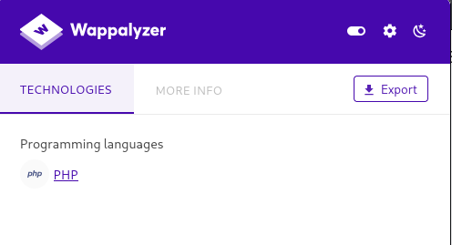
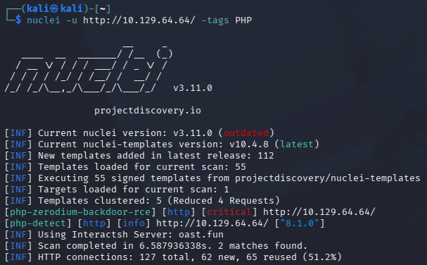
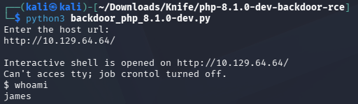
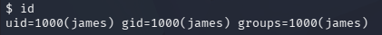
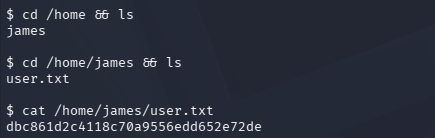
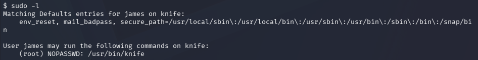
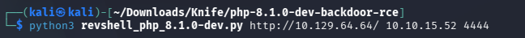
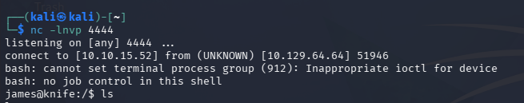
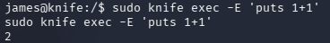

**Platform:** Hack The Box  
**Difficulty:** Easy  
**Target IP:** `10.129.64.64`


## Overview
Knife is a Linux machine compromised through a backdoor in a leaked PHP development build. A web server was found running PHP 8.1.0-dev, a version known to contain a hidden backdoor that allows remote code execution via a crafted HTTP header. Exploiting this gave a shell as the user `james` and access to the user flag. From there, `sudo -l` showed `james` could run the `knife` command as root, which can be abused to execute arbitrary Ruby code — including reading files as root. After setting up a stable reverse shell, this was used to read `root.txt` and complete the box.

## Attack Path
```
Nmap
  ↓
WEB enumeration (Apache + PHP detected)
  ↓
Nuclei Scan → PHP 8.1.0-dev Backdoor Identified
  ↓
PHP 8.1.0-dev Backdoor RCE Exploit (Github)
  ↓
Shell as James → User Flag
  ↓
Sudo -l → NOPASSWD: /usr/bin/knife
  ↓
Sudo knife exec -E 'puts File.read("/root/root.txt")'
  ↓
Root Flag

```  

## 1. Reconnaissance

An nmap scan against the target reveals two open ports: 
``22/tcp - OpenSSH``
``80/tcp - Apache 2.4.41``


## 2. Web Enumeration
Visiting the web server on port 80 shows a static landing page. 


Running Wappalyzer against the site identifies **PHP** as the backend language.



## 3. Vulnerability Identification

Running Nuclei against the web server flags a critical finding: the site is running **PHP 8.1.0-dev**, which contains a known backdoor, `zerodium-backdoor`, a malicious backdoor was discovered in the development source code of PHP 8.1.0-dev in March 2021.  The vulnerability allow the execution of arbitrary PHP code, giving attackers full control over the server, [PHP 8.1.0-dev backdoor](https://docs.escape.tech/documentation/reference/vulnerabilities/php_zerodium_backdoor_rce/#scanners-support).



## 4. Initial Foothold

A public exploit script targeting the backdoor in `PHP 8.1.0` is available on GitHub, [PHP 8.1.0-dev Backdoor Remote Code Execution](https://github.com/flast101/php-8.1.0-dev-backdoor-rce/tree/main). Running it against the target machine grants us the command execution as a regular user `james`.





**Note:** this shell is _stateless_ and each command is executed as an independent request/process by the backdoor rather than in a persistent session. This means `cd` doesn't persist between commands, and multi-step operations need to be chained with `&&` in a single line, e.g.:
## 5. User flag

The user flag is retrieved from `james`'s home directory:




## 6. Privilege Escalation

Checking sudo permissions for `james`:



`james` can run `/usr/bin/knife` as root with no password. `knife` is Chef's CLI tool, and its `exec` subcommand evaluates Ruby. [GTFO Bins Knife](https://gtfobins.org/gtfobins/knife/) documents a privilege escalation vector.

Attempting this over the stateless backdoor shell initially fails with `No input file specified.` — this turned out to be a side effect of the backdoor mangling quotes/arguments passed through it, not an issue with the payload itself. To get a clean, persistent execution context, a full reverse shell was established using the same exploit script's shell-drop capability, with a `netcat` listener on the Kali machine.





From the resulting stable reverse shell, the knife payload executes correctly. The function `knife exec -E '...'` can be performed by any unprivileged user and the function returns `2` as expected.



## 7. Root flag

To read the root flag, the following `knife exec` payload is used, leveraging Ruby's `File.read` method. Since `root.txt` conventionally resides in `/root` on HTB Linux machines, this path is targeted directly. As `knife` runs with root privileges via the NOPASSWD sudo rule, the Ruby code executes as root, bypassing normal file permissions and printing the contents of `root.txt` to the console, completing the box.


