**Platform:** Hack The Box  
**Difficulty:** Easy  
**OS:** 
**Target IP:** `10.129.57.253`

## Overview

**CVE-2007-2447** — known as the Samba "username map script" Command Execution vulnerability (often just referred to as "usermap_script").

It exploits a flaw in the `username map script` setting in `smb.conf` for Samba 3.0.20–3.0.25rc3, where shell metacharacters (like backticks) in the username get passed straight to a shell, allowing unauthenticated remote command execution, allowing retrieval of both the user and root flags.
### Attack Path
```
Nmap
  ↓
SMB Enumeration
  ↓
Samba 3.0.20 / SMBv1 (NT LM 0.12) Identified
  ↓
CVE-2007-2447 
  ↓
Metasploit
  ↓
Unauthenticated RCE
  ↓
User Flag
  ↓
Root Flag
```

### 1. Reconnaissance

I started with an Nmap scan to identify open ports and running services.

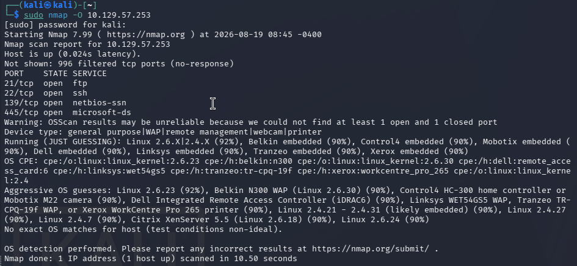

The scan identifies four open TCP Ports:

| Port    | Service      |
| ------- | ------------ |
| 21/tcp  | ftp          |
| 22/tcp  | ssh          |
| 139/tcp | netbios-ssn  |
| 445/tcp | microsoft-ds |


More in-depth nmap scans shows Anonymous FTP login is allowed. And versions running on the TCP ports, looking for potential vulnerable versions running on the machine.


| Port    | Service      | Version       |
| ------- | ------------ | ------------- |
| 21/tcp  | ftp          | vsftpd 2.3.4  |
| 22/tcp  | ssh          | OpenSSH 4.7p1 |
| 139/tcp | netbios-ssn  | -             |
| 445/tcp | microsoft-ds | -             |

Logging in as anonymous on the ftp server at `10.129.57.253`, but I don't find anything of interest as the ftp server is empty. 

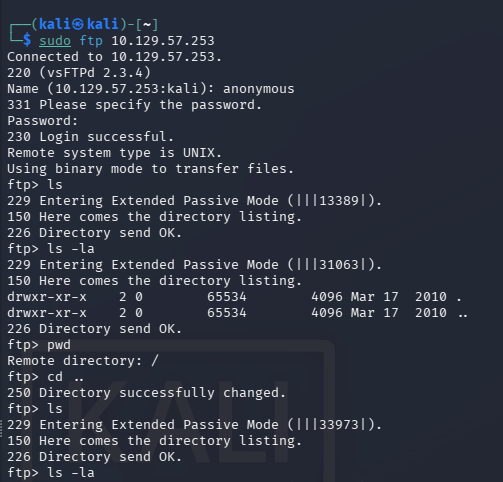


## 2. Vulnerability Identification

Searching for known vulnerabilities in vsftpd 2.3.4 using Searchsploit revealed a Backdoor Command Execution exploit (CVE-2011-2523). This version is known to contain a maliciously inserted backdoor, where a specially crafted username containing ':)' during FTP login triggers a listener on port 6200, providing an unauthenticated root shell.

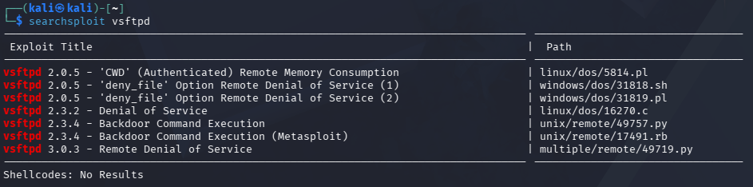

## 3. Exploitation attempt #1 (FTP – failed)

Using the **CVE-2011-2523** vulnerability, we try to establish a root shell on the machine by using Metasploit.

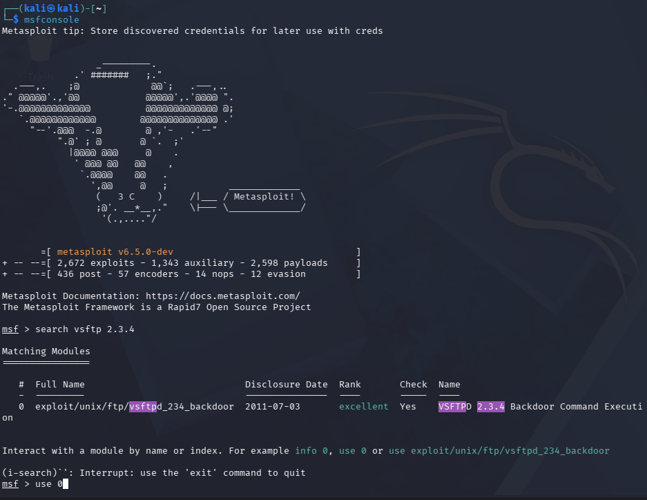

Setting the necessary options in Metasploit, where RHOST is `10.129.57.253` and LHOST to my tun0 interface `10.10.15.52` in preparation for running the exploit.

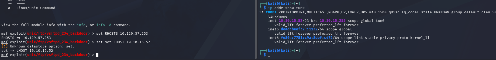

The result shows that the target machine appears to be vulnerable, as it is running the expected vsftpd 2.3.4 version. However, the exploit fails to connect on the backdoor port `6200/TCP`, and no session is created.

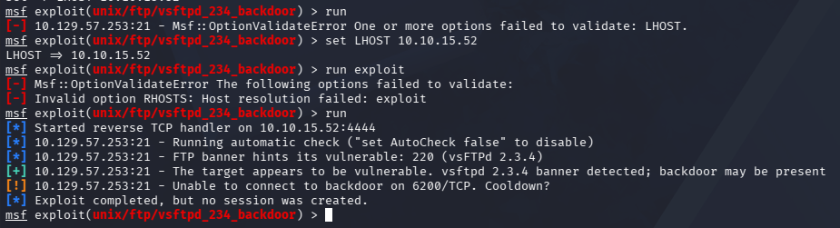

Since the vsftpd backdoor exploit did not yield a shell, I moved on to enumerate the remaining open ports, 139 and 445 (SMB), identified in the initial Nmap scan.
### 4. SMB Enumeration

With the FTP exploit unsuccessful, I therefore moved on to enumerate the SMB services to detect any vulnerable OS versions or protocols supported.

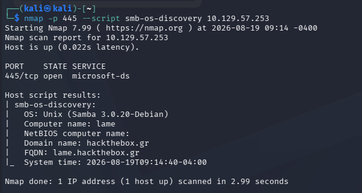

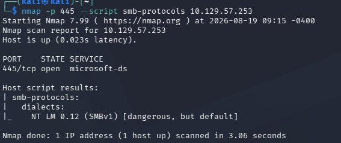

SMB server on port `445` is a  share using SMBv1, which is an obsolete protocol known to be vulnerable. Furthermore the results confirms:
- OS: **Samba 3.0.20-Debian**
- Computer name: **lame**
- Domain Name: **hackthebox.gr**
- FQDN: **lame.hackthebox.gr**
- SMB-protocols: **NT LM 0.12 (SMBv1)**

## Exploitation attempt #2 (Samba - success)

Using the **CVE-2007-2447** vulnerability in Samba 3.0.20 exploits a flaw in the `username map script` setting in `smb.conf` for Samba 3.0.20–3.0.25rc3, where shell metacharacters (like backticks) in the username get passed straight to a shell, allowing unauthenticated remote command execution. We run the exploit in Metasploit.

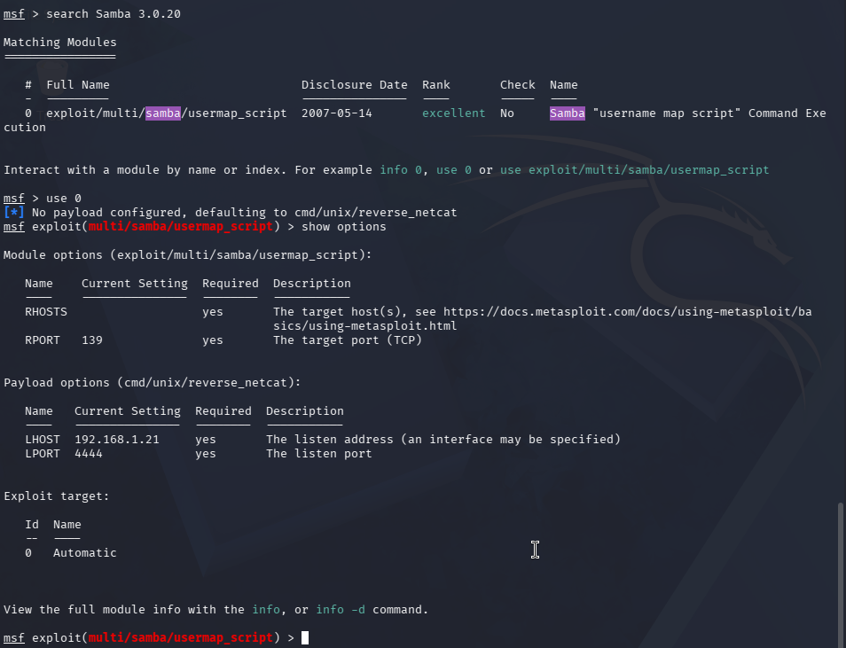

Setting the necessary options in Metasploit, where RHOST is `10.129.57.253` and LHOST to my tun0 interface `10.10.15.52` in preparation for running the exploit. Executing the exploit successfully returned a shell running as root.

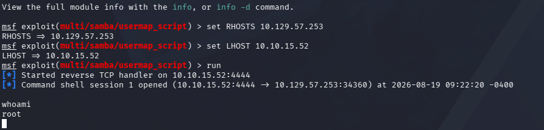
## 5. User flag
Since the target is running Debian (confirmed earlier via SMB enumeration), I knew the standard filesystem layout, including that user home directories are typically located under `/home`. Running `whoami` confirmed I had a root shell, giving unrestricted access to the filesystem. Navigating to `/home`, I found the user `makis` and located `user.txt` in their home directory

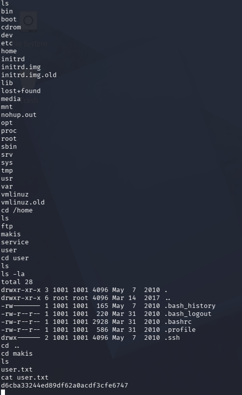

## 6. Root flag
Since the shell already had root privileges, no further privilege escalation was required. Navigating to `/root`, I located `root.txt`, completing the box.

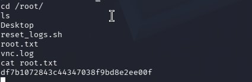