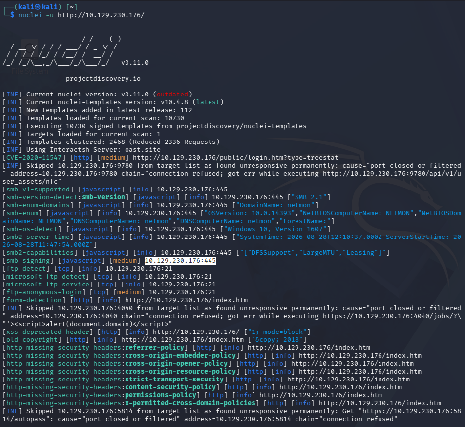
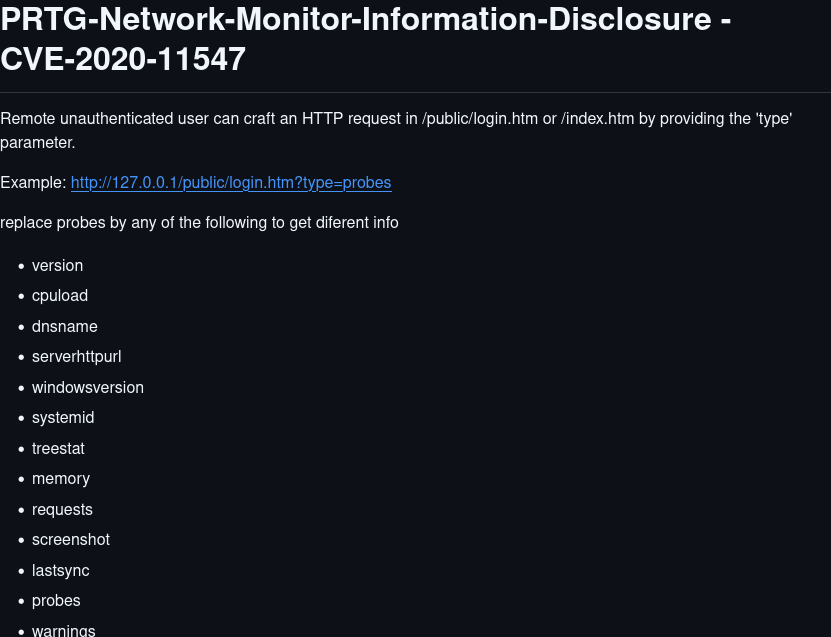
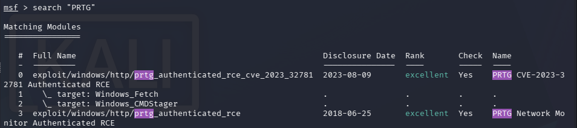
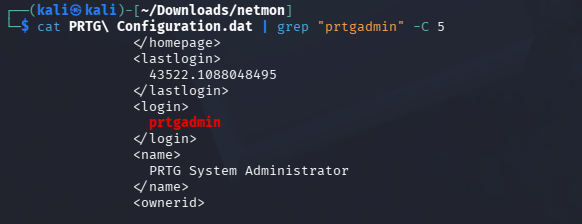
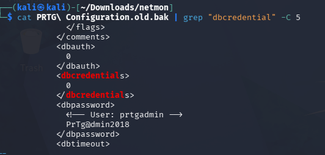
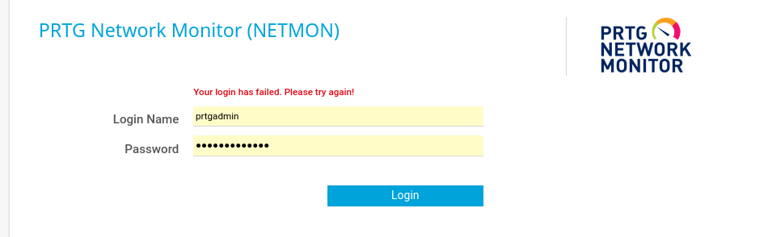
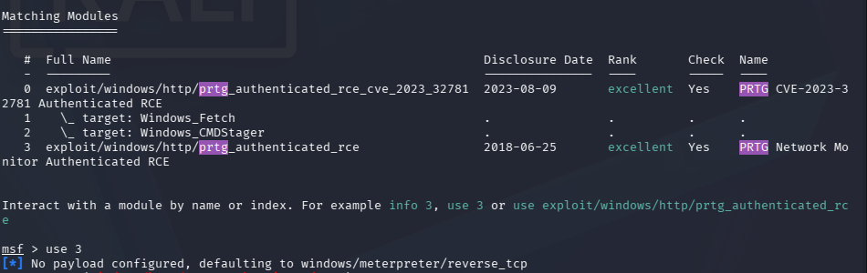
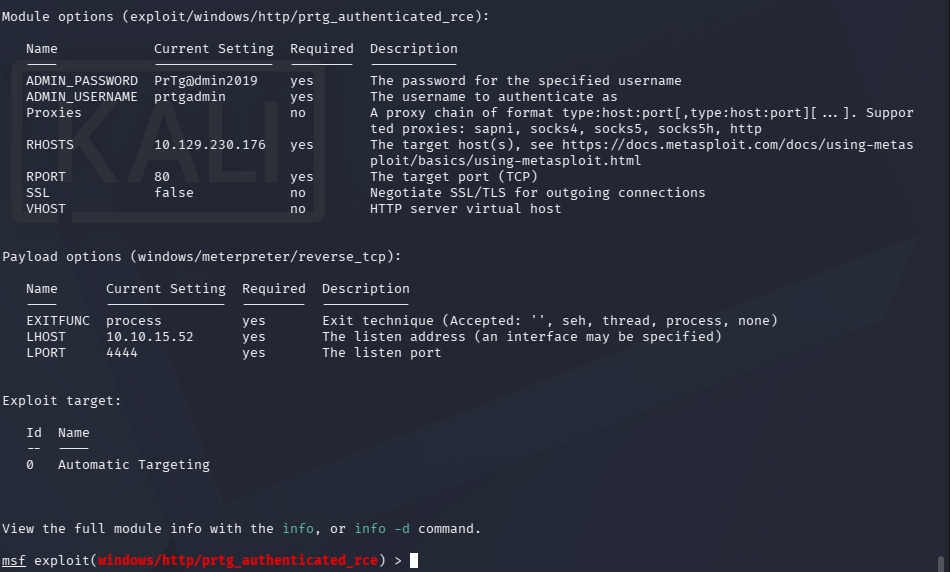
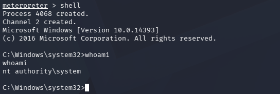

**Platform:** Hack The Box  
**Difficulty:** Easy  
**OS:** Windows  
**Target IP:** `10.129.230.176`


## Overview
Netmon is a Windows machine compromised through exposed PRTG Network Monitor credentials. Initial enumeration identified FTP with anonymous access enabled, a web server running PRTG Network Monitor, and SMB. Anonymous FTP access allowed retrieval of the user flag and PRTG configuration backups, one of which contained a cleartext admin credential. Using the recovered credentials, we accessed the PRTG admin dashboard and exploited it with an authenticated RCE module in Metasploit, obtaining a SYSTEM-level Meterpreter session and the root flag.
### Attack Path

```
Nmap
  ↓
FTP anonymous login -> User flag
  ↓
SMB Enumeration (dead end)
  ↓
PRT Web Enumeration (Nuclei, CVE-2020-11547)
  ↓
Config File Extraction via FTP (PRTG Configuration.Old.bak)
  ↓
PRTG Admin Credentials (prgadmin:PrTg@dmin2019)
  ↓
Metasploit: exploit/windows/http/prtg_authenticated_rce
  ↓
Meterpreter Session (NT AUTHORITY\SYSTEM)
  ↓
Administrator / Root Flag
```

## 1. Reconnaissance

An Nmap scan shows FTP on port 21 with anonymous login allowed, a web server on port 80 (PRTG Network Monitor / NetMon), and SMB on port 445.


Logging into FTP with `anonymous:anonymous` grants access to the machine. After browsing the available directories:


Attempting to `cd` into the Administrator folder is denied — we don't yet have permission to access it.


## 2. User flag

Navigating into the Public user's Desktop reveals `user.txt`. We download it to our Kali machine and read the flag:


 
 


## 3. Enumeration

**SMB (dead end):** We enumerated SMB on port 445 to check OS version and supported protocols. SMBv1 was found enabled, which is historically associated with vulnerabilities (e.g., EternalBlue) — however, no viable SMB attack vector was found on this box, so we moved on.

**Web (port 80):** Visiting the web server shows the PRTG Network Monitor login page.


A Nuclei scan against the web server flags several vulnerabilities, including **CVE-2020-11547**:



CVE-2020-11547 affects PRTG Network Monitor versions before 20.1.57.1745 and allows unauthenticated remote attackers to obtain information about probes running on the server (CPU usage, memory, Windows version, and internal statistics) via an HTTP request, e.g. `type=probes` appended to `login.htm` or `index.htm`.



Using this, we pull additional information about the PRTG instance running on the web server.


## 4. Credentials Extraction & Exploitation

Checking for known vulnerable RCE or unauthenticated attacks for PRTG is Metasploit, but the exploits shown requires an authenticated RCE. This leads us to look for any credential with the information and access we have already obtained. I do some research on the PRTG Netmon software and find that the configuration files should be stored and accessible from the anonymous FTP access we have already obtained: [Paessler Support article.](https://helpdesk.paessler.com/en/support/solutions/articles/76000041654-how-and-where-does-prtg-store-its-data)



Continuing looking in the FTP server after reading up on the PRTG Network Monitor and finding out the config files are stored in `C:\ProgramData\Paessler\PRTG Network Monitor\` where our permissions lets us download `PRTG Configuration.dat, "".old and "".old.bak`. We look into the files for any user credentials to the log in website or anything else interesting in the config files.


After some filtering out and information gathering on netmon service, we grep for the `prtgadmin` which is the basic configuration for the username login on the admin console login. We try to look for further passwords, but they are stored encrypted and hidden in both the `PRTG Configuration.dat` and `Configuration.old`. 



However, the credential is stored in cleartext in the `Configuration.old.bak` where we obtain the credential prtgadmin:PrTg@dmin2018.



After too many unsuccessful logins with the credentials from `Configuration.old.bak` given the  this machine was released in 2019 and the configuration being old, we guess the admin rotated the password by bumping the year has replaced 2018 with 2019. 



We now have access to the PRTG administrator dashboard.


From earlier looking at the available exploits in Metasploit requiring an authenticated exploit, we can now try out the `exploit/windows/http/prtg_authenticated_rce` to get a meterpreter session.



Setting the following options for the machine, including admin credentials and using our tun0 ip to obtain a meterpreter session on the machine.



The exploit succeeds, and dropping to a shell confirms we're running as `NT AUTHORITY\SYSTEM`, the highest privilege level on Windows. This gives us access to the Administrator directory that was off-limits via FTP earlier.



## 5. Root flag

Root.txt was found in the Administrators Desktop.

